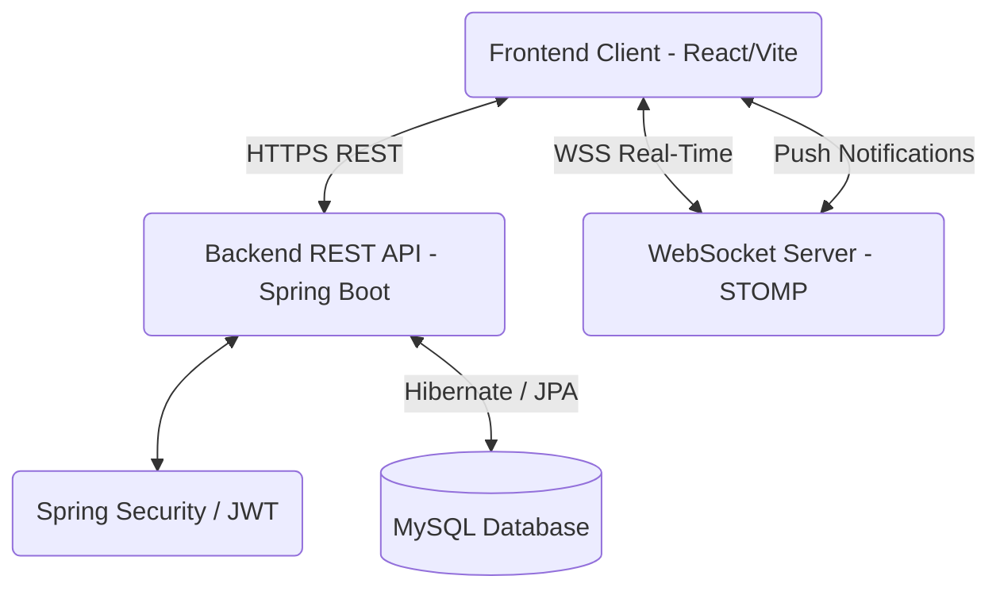

<div align="center">
  
  <h1>EduScope Connect</h1>
  <p><strong>A Modern, Gamified, Full-Stack Educational Community Platform</strong></p>

  <!-- Badges -->
  <p>
    
    
    
    
    
    
  </p>
</div>

<hr />

## 📖 Overview

**EduScope Connect** is a cutting-edge educational technology platform designed to bridge the gap between students, educators, and institutions. By combining a gamified learning experience with a robust set of community tools, EduConnect transforms how users share knowledge, collaborate, and track their educational progress. 

Whether it's discussing complex topics in the Q&A forum, collaborating in real-time study groups, taking practice assessments, or managing users via a comprehensive admin dashboard, EduConnect offers a complete, scalable, and secure educational ecosystem.

## ✨ Key Features

- **🗣️ Community Q&A Forum:** Ask questions, provide answers, and upvote/downvote content. Features rich-text markdown support and tags.
- **👥 Real-Time Study Groups:** Join category-specific study groups (e.g., *Advanced Machine Learning*) and chat with other members in real-time using WebSockets.
- **🏆 Gamification & Leaderboard:** Earn reputation points for asking good questions and providing helpful answers. Compete on the global leaderboard.
- **📝 Practice Assessments:** Interactive quizzes and calculations (e.g., RxCalculations) to test knowledge.
- **🛡️ Role-Based Access Control (RBAC):** Strict JWT-based authentication supporting `STUDENT`, `LEADER`, and `ADMIN` roles.
- **📊 Admin & Leader Dashboards:** Powerful tools for content moderation, user management, and system analytics.
- **🌐 Technology Ecosystem Showcase:** A dynamic interface highlighting external AI-powered educational tools integrated within the EduScope global network.

---

## 🛠️ Technology Stack

### Backend
- **Core:** Java 17, Spring Boot 3
- **Security:** Spring Security, JWT (JSON Web Tokens)
- **Data Persistence:** Hibernate / Spring Data JPA
- **Database:** MySQL
- **Real-Time:** Spring WebSocket / STOMP

### Frontend
- **Core:** React 18, Vite
- **Styling:** Tailwind CSS, Material 3 Design Aesthetics
- **Animations:** Framer Motion
- **Routing:** React Router v6
- **Icons:** Lucide React

---

## 🏗️ System Architecture



---

## 📂 Folder Structure

```text
educonnect/
├── backend/                       # Spring Boot Application
│   ├── src/main/java/com/educonnect/
│   │   ├── config/                # Security, CORS, WebSockets
│   │   ├── controller/            # REST API Endpoints
│   │   ├── model/                 # JPA Entities
│   │   ├── repository/            # Database Interfaces
│   │   ├── security/              # JWT & Authentication Logic
│   │   └── service/               # Core Business Logic
│   └── src/main/resources/        # application.properties
│
├── frontend/                      # React / Vite Application
│   ├── src/
│   │   ├── components/            # Reusable UI & Ecosystem Components
│   │   ├── context/               # AuthContext & WebSocketContext
│   │   ├── pages/                 # Full Page Views (Routing)
│   │   └── utils/                 # Axios API Interceptors
│   ├── .env.production            # Prod Environment Variables
│   └── tailwind.config.js         # Tailwind Design Tokens
└── README.md
```

---

## 🚀 Getting Started

### Prerequisites
Before you begin, ensure you have the following installed on your machine:
- **Java 17+** (JDK)
- **Node.js 18+** & npm/yarn
- **MySQL 8.0+**
- **Git**

### 1. Database Setup
Create a new MySQL database for the project:
```sql
CREATE DATABASE educonnect;
```

### 2. Backend Setup
1. Navigate to the backend directory:
   ```bash
   cd backend
   ```
2. Configure Environment Variables. Set the following variables in your OS, or update `src/main/resources/application.properties` directly for local testing:
   ```env
   DB_URL=jdbc:mysql://localhost:3306/educonnect
   DB_USERNAME=root
   DB_PASSWORD=your_mysql_password
   JWT_SECRET=YourVeryStrongAndSecureJWTSecretKeyHere2024
   CORS_ALLOWED_ORIGINS=http://localhost:5173
   ```
3. Run the Spring Boot application:
   ```bash
   mvn spring-boot:run
   ```
   *The backend will start on `http://localhost:8080`.*

### 3. Frontend Setup
1. Navigate to the frontend directory:
   ```bash
   cd frontend
   ```
2. Install dependencies:
   ```bash
   npm install
   ```
3. Run the development server:
   ```bash
   npm run dev
   ```
   *The frontend will start on `http://localhost:5173`.*

---

## 🔒 Authentication & Authorization

EduConnect uses **JSON Web Tokens (JWT)** for stateless authentication. 
- Upon successful login, the server issues a JWT.
- The frontend stores this token and attaches it to the `Authorization: Bearer <token>` header via an Axios interceptor (`utils/api.js`).
- If a `403 Forbidden` or `401 Unauthorized` response is received, the frontend automatically handles session expiration and redirects to the login screen.

**Roles:**
- `STUDENT`: Can ask questions, join groups, and answer.
- `LEADER`: Elevated privileges to manage specific study groups and answer authoritative queries.
- `ADMIN`: Full access to the Admin Dashboard, system settings, audit logs, and content moderation.

---

## 🔌 API Overview

*Below is a high-level overview of the core REST endpoints.*

| Endpoint | Method | Description | Access |
|---|---|---|---|
| `/api/auth/register` | `POST` | Register a new user | Public |
| `/api/auth/login` | `POST` | Authenticate and receive JWT | Public |
| `/api/questions` | `GET` | Fetch paginated forum questions | Public |
| `/api/questions` | `POST` | Create a new question | Authenticated |
| `/api/groups` | `GET` | Fetch all study groups | Authenticated |
| `/api/groups/{id}/join` | `POST` | Join a specific study group | Authenticated |
| `/api/admin/users` | `GET` | Fetch all registered users | `ADMIN` only |
| `/api/ecosystem` | `GET` | Fetch dynamic technology products | Public |

---

## 📸 Screenshots

| Home / Landing Page | Study Groups |
|---|---|
| ** | ** |

| Q&A Forum | Admin Dashboard |
|---|---|
| ** | ** |

*(Note: Replace placeholders with actual screenshots of the application)*

---

## 🌍 Deployment

### Deploying the Backend (Render / Heroku)
1. Ensure `app.features.enable-seeder=false` in production.
2. Ensure `spring.jpa.hibernate.ddl-auto=validate`.
3. Provide the production database credentials via `DB_URL`, `DB_USERNAME`, and `DB_PASSWORD`.
4. Deploy the Spring Boot `.jar` file or connect your GitHub repository directly to a PaaS provider.

### Deploying the Frontend (Vercel / Netlify)
1. Update `.env.production` with your live backend API URL:
   ```env
   VITE_API_BASE_URL=https://api.yourbackend.com
   ```
2. Run the build command:
   ```bash
   npm run build
   ```
3. Deploy the `dist/` directory.

---

## 🐛 Troubleshooting

- **CORS Errors:** Ensure that `CORS_ALLOWED_ORIGINS` in the backend exactly matches the URL of your frontend (e.g., no trailing slashes).
- **Database Connection Refused:** Verify that MySQL is running on port 3306 and that your `DB_USERNAME` and `DB_PASSWORD` are correct.
- **Blank Page on Frontend:** Check the browser console. If API requests are failing with `404` or `Network Error`, ensure the backend is running and `VITE_API_BASE_URL` is set correctly.

---

## 🤝 Contributing

Contributions make the open-source community such an amazing place to learn, inspire, and create. Any contributions you make are **greatly appreciated**.

1. Fork the Project
2. Create your Feature Branch (`git checkout -b feature/AmazingFeature`)
3. Commit your Changes (`git commit -m 'Add some AmazingFeature'`)
4. Push to the Branch (`git push origin feature/AmazingFeature`)
5. Open a Pull Request

---

## 📜 License

Distributed under the MIT License. See `LICENSE` for more information.

---

## 📬 Contact

**Dulanjan Hasaranga** - [GitHub Profile](https://github.com/dulanjanhasaranga)

Project Link: [https://github.com/dulanjanhasaranga/EduScope-Connect](https://github.com/dulanjanhasaranga/EduScope-Connect)

<p align="center">
  <br>
  ⭐️ If you found this project helpful, please give it a star! ⭐️
</p>
